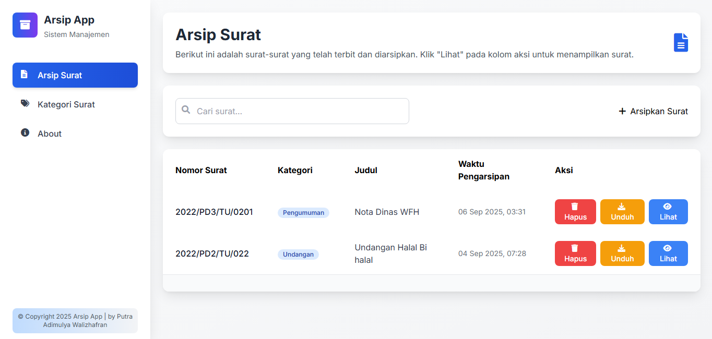
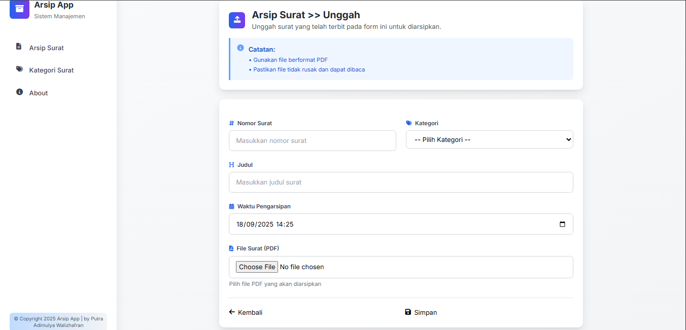
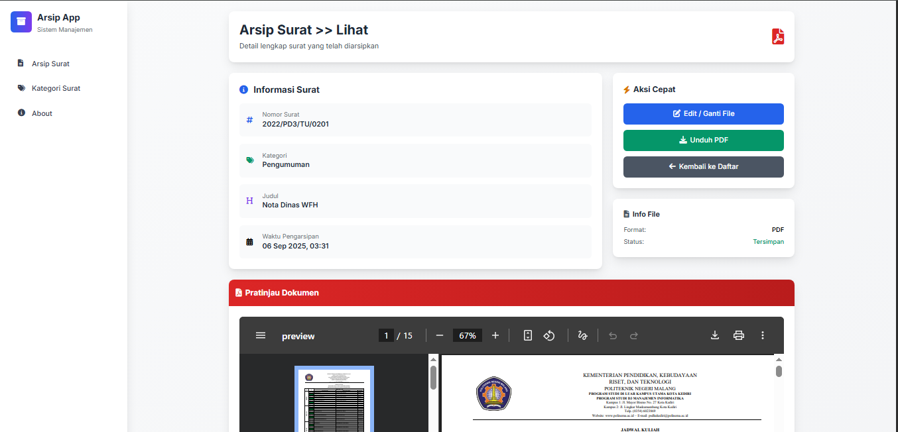
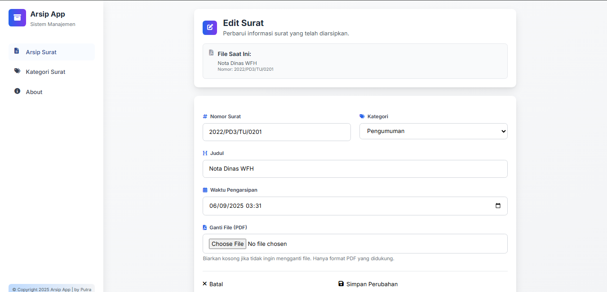
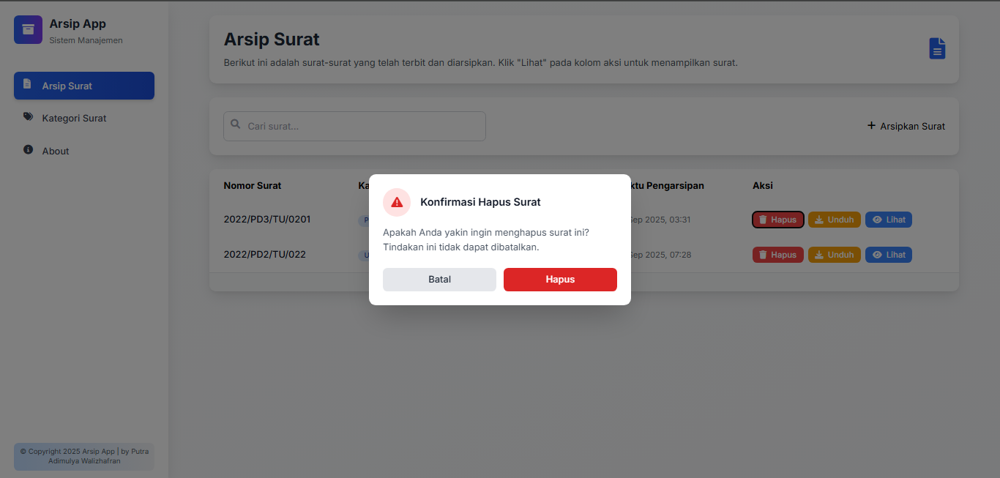
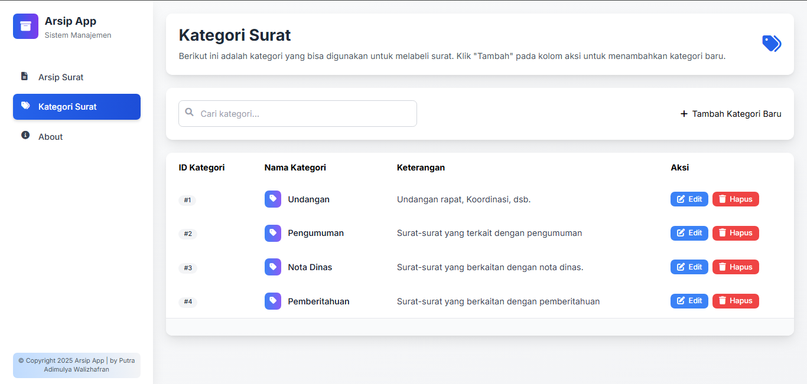
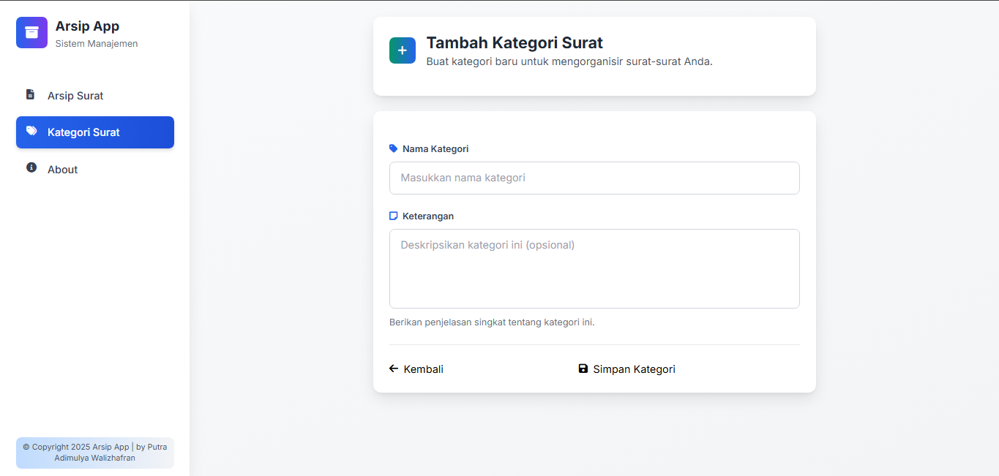
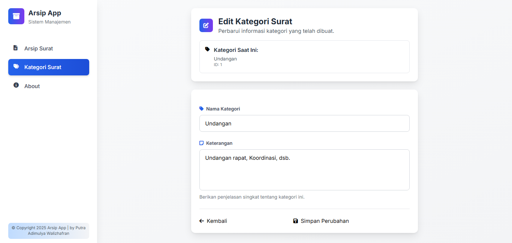
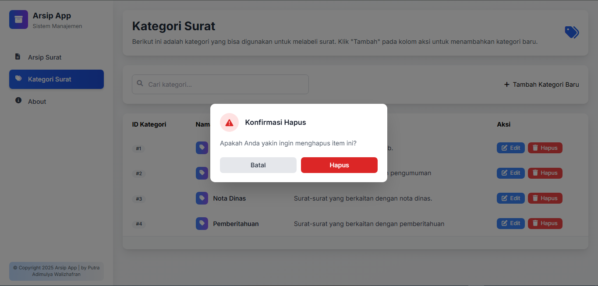
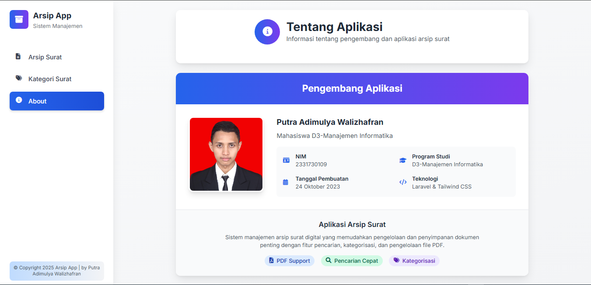

# Arsip App

## Tujuan

Aplikasi Arsip App adalah sistem manajemen arsip surat digital yang dirancang untuk memudahkan pengelolaan dan penyimpanan dokumen penting. Aplikasi ini memungkinkan pengguna untuk mengorganisir surat-surat berdasarkan kategori, melakukan pencarian cepat, serta mengelola file PDF dengan fitur upload, download, dan preview.

## Fitur

### Manajemen Surat
- **Tambah Surat**: Upload surat baru dengan file PDF, nomor surat, judul, tanggal pengarsipan, dan kategori
- **Edit Surat**: Perbarui informasi surat yang sudah ada
- **Hapus Surat**: Hapus surat dari sistem dengan konfirmasi
- **Lihat Detail Surat**: Tampilkan informasi lengkap surat
- **Download Surat**: Unduh file PDF surat
- **Preview Surat**: Lihat preview file PDF surat di browser
- **Pencarian Surat**: Cari surat berdasarkan judul
- **Pagination**: Navigasi halaman untuk daftar surat

### Manajemen Kategori
- **Tambah Kategori**: Buat kategori baru untuk mengorganisir surat
- **Edit Kategori**: Perbarui nama dan keterangan kategori
- **Hapus Kategori**: Hapus kategori dari sistem
- **Pencarian Kategori**: Cari kategori berdasarkan nama

### Fitur Tambahan
- **File Management**: Penyimpanan file PDF yang aman dengan validasi
- **Search Functionality**: Pencarian real-time untuk surat dan kategori
- **User Interface**: Antarmuka yang intuitif dan mudah digunakan

## Teknologi yang Digunakan

- **Backend**: Laravel 12 (PHP Framework)
- **Frontend**: Blade Templates, Tailwind CSS
- **Database**: MySQL
- **Build Tool**: Vite
- **File Storage**: Laravel Storage (untuk file PDF)

## Cara Menjalankan

### Langkah Instalasi

1. **Clone Repository**
   ```bash
   git clone https://github.com/putraadm/ArsipApp.git
   cd arsip-app
   ```

2. **Install Dependencies PHP**
   ```bash
   composer install
   ```

3. **Install Dependencies JavaScript**
   ```bash
   npm install
   ```

4. **Konfigurasi Environment**
   ```bash
   cp .env.example .env
   ```

   Edit file `.env` dan konfigurasikan database:
   ```env
   DB_CONNECTION=mysql
   DB_HOST=127.0.0.1
   DB_PORT=3306
   DB_DATABASE=arsip_app
   DB_USERNAME=your_username
   DB_PASSWORD=your_password
   ```

5. **Generate Application Key**
   ```bash
   php artisan key:generate
   ```

6. **Create a symlink for static file**
   ```bash
   php artisan storage:link
   ```

7. **Jalankan Migrasi Database**
   ```bash
   php artisan migrate
   ```

### Menjalankan Aplikasi

1. **Jalankan Server Laravel**
   ```bash
   php artisan serve
   ```

2. **Akses Aplikasi**
   
   Buka browser dan akses `http://localhost:8000`

### Perintah Development Lainnya

- **Build Assets untuk Production**
  ```bash
  npm run build
  ```

- **Jalankan Testing**
  ```bash
  php artisan test
  ```

## Dokumentasi
Halaman Utama Arsip

Halaman Tambah Arsip

Halaman Lihat Arsip

Halaman Edit Arsip

Halaman Konfirmasi Hapus Arsip

Halaman Utama Kategori Arsip

Halaman Tambah Kategori

Halaman Edit Kategori

Halaman konfirmasi Hapus Kategori

Halaman About
